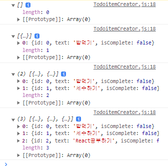

# 🏆 Recoil 상태관리 라이브러리 공홈 Demo 연습하기

1. 설치

   ```
   npm install recoil
   ```

2. RecoilRoot

   > recoil 상태를 사용하는 컴포넌트는 부모 트리 어딘가에 나타나는 RecoilRoot 가 필요  
   > 루트 컴포넌트가 RecoilRoot를 넣기에 가장 좋다.
   > 

3. Atom 생성
   

   > 상태(State)의 일부를 나타낸다 Atoms는 어떤 컴포넌트에서나 읽고 쓸 수 있다.  
   > atom의 값을 읽는 컴포넌트들은 암묵적으로 Atom을 구독하기 때문에 Atom에 어떤 변화가 있으면 Atom을 구독하는 모든 컴포넌트들이 재 렌더링 되는 결과가 발생한다.

4. Component 생성
   

5. Recoil에서 제공하는 useRecoilState() HookAPI를 사용하여 Component가 Atom을 구독 하게 만들어 주기
   

   > useRecoilState를 사용하여 Recoil을 구독한 상태로 만들었기 때문에 해당 값이 변경됨에 따라 input valu값도 변경

6. Selector를 사용하여 변경되는 데이터를 가공할 순수함수 작성
   

   > Atom 또는 Selector 상태를 입력받아 동적인 데이터를 반환하는 순수함수  
   > Selector가 참조하던 다른 상태가 변경되면 이도 같이 업데이트되며 이 때 Selector를 바라보던 컴포너느들이 리렌더링된다.

7. useRecoilValue HookAPI 사용으로 charCountState의 값을 읽어주기
   

8. 동작 GIF  
   

<br/>
<br/>
<br/>

# 🏆 Recoil 상태관리 라이브러리를 사용하여 간단한 TodoApp 구성연습하기

1. 설치

   ```
   npm install recoil
   ```

2. RecoilRoot

   > recoil 상태를 사용하는 컴포넌트는 부모 트리 어딘가에 나타나는 RecoilRoot 가 필요  
   > 루트 컴포넌트가 RecoilRoot를 넣기에 가장 좋다.
   > 

3. Atom 생성
   

   > Demo때와는 다르게 따로 js파일 구성하여 사용

4. 새로운 ToListUI 구성
   

5. 신규 TodoItem이 있으면 Atom에 업데이트하는 코드 생성
   ![TodoItem]./ReadmeImageTodo/(TodoItem.png)

6. useRecoilValue Hook을 사용하여 TodoListState(Atom)값을 읽어서 출력 UI 만들기
   

   > 수정기능구현 예정으로 수정이 가능한 input태그로 생성

7. 수정 기능 구현
   

8. 할일 체크 유무 기능 구현
   

9. 삭제 기능구현
   

10. 필터링 기능 구현 (모든리스트, 진행하고있는리스트, 진행완료한리스트)

    > filter Atom, seletor 생성 
    > filter 할 수 있는 UI 생성 
    > select의 option 값으로 case문이 실행 될 수 있도록 함수작성 
    > filter된 data로 UI 출력

    > filteredTodoListState는 내부적으로 2개의 의존성 todoListFilterState와 todoListState을 추적하며 둘 중 하나라도 변하면 filteredTodoListState는 재 실행되는 방식이다.

11. 통계 기능 구현

    > 통계를 낼 수 있도록 seletor생성  
    > 통계UI 생성 후 App 컴포넌트에서 사용 

12. 실행 GIF  
    

<br/>

# 🏆 비동기 데이터쿼리 사용해보기> Selector를 이용해서 비동기 요청을 한 데이터를 전역 상태에 넣어주기

> seletor는 기본적으로 값을 자체적으로 캐싱한다.  
> 만약 입력된 적 있는 값이라면 그 값을 기억하고, 이 값이 다시 호출 되면 이전에 캐싱된 결과를 바로 보여주기 때문에 비동기 데이터를 다루는 측면에서 유리하다.
